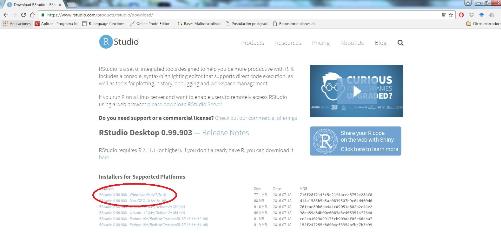
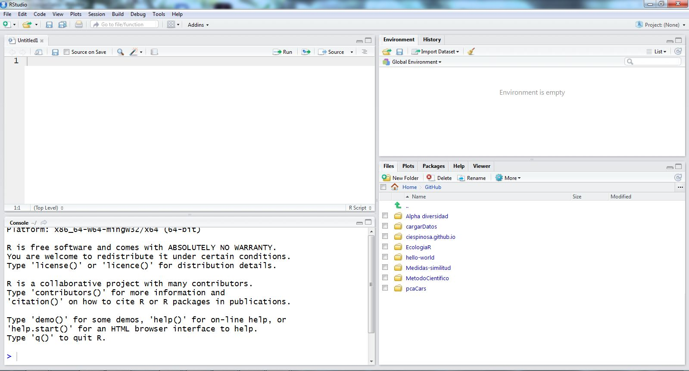
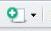
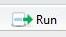
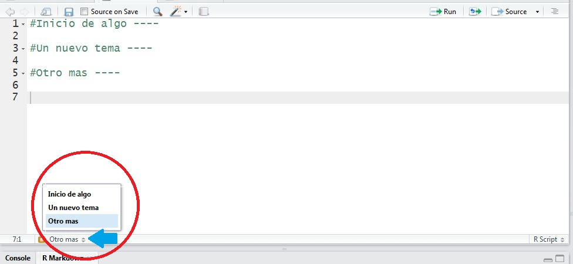

<p> <br> </p>

Pueden descargar este documento en pdf haciendo clic [aquí](https://github.com/Ciespinosa/introducionR/blob/master/index.pdf)


<p> <br> </p>

#Instalando R y RStudio

-----

El primer paso será instalar `R` y `RStudio`, aunque existen muchas plataformas para trabajar con `R`, `RStudio` ofrece algunas ventajas por las que seleccionamos esta plataforma.  

Para instalar `R` ingresa en la página web de [r-project](https://cran.r-project.org/bin/windows/base/). Una vez en esta página selecciona descargar (Figura 1).  Sigue los pasos para terminar la instalación.

<p> <br> </p>


<p> <br> </p>

La instalación de `RStudio` es similar a R debe ingresar en la página de [RStudio](https://www.rstudio.com/products/rstudio/download/). Una vez en la página de descarga, seleccione la plataforma acorde a su sistema operativo (Figura 2) y siga los pasos para terminar la instalación.

<p> <br> </p>



<p> <br> </p>


Una vez que hemos instalado R y RStudio podremos trabajar con los datos. 

>"El uso de comandos exige una curva de aprendizaje mayor que el requerido por las interfaces gráficas, pero las ganancias en términos de independencia, creatividad y control no son comparables. Escribir un código supone una comprensión más profunda de aquello que se desea aplicar" (Elousa 2011).

#El funcionamiento de R

-----

Hemos hablado mucho de `R` pero hasta ahora no hemos dicho que es, ¿es un programa?, no realmente no es un programa es un entorno de programación. R es considerado un dialecto del lenguaje _S_ el cual fue desarrollado por los  Laboratorios AT&T Bell.  

Aunque mucha gente se asusta cuando hablamos de R como un lenguaje de programación, realmente R es un lenguaje bastante simple, el cual está orientado a _Objetos_, por otro lado, a diferencia de otros lenguajes de programación los comandos escritos en el teclado son ejecutados directamente sin necesidad de construir ejecutables.

En R tenemos al menos 3 clases de objetos;  funciones, matrices de datos y resultados.  Cada uno de estos objetos tiene unas características propias.  Las _funciones_ normalmente se encuentran dentro de paquetes, estos objetos traen comandos que me permiten manipular los datos. Accedemos a las funciones a través de comandos. Los _datos_ son matrices o vectores de información los cuales son manipulados por las funciones. Los _resultados_ son objetos resultantes de la manipulación de los datos (Figura 5).

```{r, echo=FALSE, fig.align='center', fig.cap="Figura 5. Esquema del funcionamiento de r. Basado en Paradis 2003", fig.height=4, fig.width=7}

x <- 1:100
y <- 1:100 

par(mar=c(1,5,1,5))
plot(x, y, type="n", ann=FALSE,axes=FALSE, col="grey") 
box(col="grey")
rect(min(x), min(y)+2, max(x)-55, max(y))
rect(min(x)+55, min(y)+2, max(x), max(y))

rect(min(x)+5, min(y)+5, max(x)-60, max(y)-85, lty="dashed")
rect(min(x)+5, min(y)+40, max(x)-60, max(y)-40, lty="dashed")
rect(min(x)+5, min(y)+85, max(x)-60, max(y)-5, lty="dashed")

text(12,10, "Resultados", adj=0)
text(17,50, "Datos", adj=0)
text(12,92, "Funciones", adj=0)

text(62,17.5, "Archivos de salida", adj=0, cex=0.9)
rect(min(x)+60, min(y)+5, max(x)-25, max(y)-85,  col="blue")
rect(min(x)+80, min(y)+5, max(x)-5, max(y)-85,  col="blue")
text(63, 11, "JPG", col="white", font=2, adj=0, cex=0.8)
text(83, 11, "XLSX", col="white", font=2, adj=0, cex=0.8)

text(63, 50, "Datos y archivos", col="black", adj=0, cex=0.9)
text(63, 92, "Librería de 
funciones", col="black", adj=0, cex=0.9)

mtext("Internet", side=3, line =-2.5,col="black", font=3, at=120, cex=0.9)
mtext("Comandos", side=3, line =-2.5,col="black", font=3, at=-15, cex=0.9)
mtext("Pantalla", side=3, line =-8,col="black", font=3, at=-15, cex=0.9)

mtext("Memoria Activa", side=1, line =-1,col="black", font=4, at=20, cex=0.9)
mtext("Disco Duro", side=1, line =-1,col="black", font=4, at=80, cex=0.9)

par(new=TRUE)
par(mar=c(1,1,1,1))
plot(x, y, type="n", ann=FALSE,axes=FALSE, col="grey") 
arrows(93, 91, 75, 91, length=0.08,angle=30,lwd=2)
arrows(93, 91, 45, 50, length=0.08,angle=30,lwd=2)

arrows(58, 91, 45, 91, length=0.08,angle=30,lwd=2)
arrows(58, 50, 45, 49, length=0.08,angle=30,lwd=2)

arrows(9, 91, 18, 91, length=0.08,angle=30,lwd=2)
arrows(8, 52, 18, 50, code=1, length=0.08,angle=30,lwd=2)
arrows(37, 48, 60, 20, length=0.08,angle=30,lwd=2)

```

El funcionamiento de R se da en la memoria activa, así que cada vez que iniciamos a trabajar con R es necesario llamar los datos desde el disco duro a la memoria activa.  Para llamar paquetes (donde tenemos las funciones) normalmente utilizamos la función `library`, mientras que para llamar los datos utilizamos funciones como `read.table`. Algunas veces nos interesa grabar un resultado desde la memoria activa al disco duro para esto podemos utilizar funciones como `write.table`. Finalmente, no todos los paquetes disponibles se bajan cuando instalamos R, de hecho solo se baja un paquete conocido como paquete base. Cuando se necesita un nuevo paquete, este debe llamarse desde internet, para ello utilizamos la función ìnstall.packages`. Existe un repositorio de todos los paquetes disponibles (Comprehensive R Archive Network, __CRAN__) y varios países tienen espejos de estos repositorios (espejos CRAN) a partir de los cuales podemos descargar los paquetes.

>Es muy importante que antes de empezar a trabajar con R seamos conscientes de cómo funciona, esto facilitará entender lo que está haciendo.

#Los primeros pasos

------

##Conozcamos rStudio antes de empezar



<p> <br> </p>

Como vemos en la figura 3, RStudio está compuesto por cuatro ventanas.  Seguramente en su caso, si acaba de generar el proyecto le aparecerán únicamente tres ventanas. A continuación describiré cada una de las ventanas.

La __primera ventana__ (la que en su caso seguramente no asoma, izquierda superior) lo constituye documentos que pueden ser de varios tipos. El tipo básico es un documento con extensión __.R__ y que nos sirven para ir guardando el código que vamos construyendo para el análisis.  Vamos abrir un script, esto lo podemos hacer de al menos tres maneras, la primera es ir al menú de la consola seleccionar `File > New File > script`, la segunda forma es seleccionar el icono del documento con una cruz verde  y seleccionar `R script`.  La última opción es hacerlo desde el teclado si presionan alt + shift (mayúsculas) y la tecla __N__ obtendrá el mismo resultado.

Existen otros muchos archivos que podemos cargar, pero por ahora este es suficiente.

La __segunda ventana__ (derecha superior), esta ventana se verán todos los objetos que iremos cargando durante el trabajo en RStudio por ahora esta ventana estará vacía.  

>Vamos a generar algunos objetos y ver lo que pasa.

```{r}
nombre<- "Carlos Ivan"
apellido<- "Espinosa Iñiguez"
matriz<- matrix(1:20, 5,4)

```

Ahora podemos ver los objetos creados, algunos salen como valores y la matriz sale como datos.  Los objetos que son datos, puedo abrirlos para ver su estructura.  Si hacen clic en el nombre matriz verán que se abre una nueva hoja en la primera ventana que corresponde a estos datos.

La __tercera columna__ (izquierda abajo), corresponde a la consola de R, esta es la consola donde se ejecutarán todos los códigos y se realizarán los análisis.

La _cuarta columna__ (derecha abajo), en esta ventana tenemos varias pestañas.  La primera `File` nos muestra todos los archivos que están en la carpeta de mi proyecto. La siguiente pestaña `Plots` en esta se verán los gráficos que iré realizando. La pestaña `Help` puede ser usada para pedir ayuda de algún paquete o función que me interese.

Bueno ya conocemos RStudio ahora si a trabajar.

##¿Cómo trabajar en RStudio?

El trabajo de programación requiere que seamos muy ordenados en lo que hacemos, es por esto que considero que el trabajar con RStudio nos ofrece una ventaja.  Con RStudio podemos generar proyectos que nos permitirán tener nuestra información organizada (puedes acceder a este [enlace](https://ciespinosa.github.io/cargarDatos/) si quieren saber cómo crear un nuevo proyecto). 

Si bien podemos trabajar directamente en la consola, lo mejor es que desde el principio nos acostumbremos a generar scripts donde tengamos la información limpia y podamos siempre saber lo que estamos haciendo.

__Algunos consejos iniciales__

a. Todos los códigos que ponemos siempre deben ir acompañados de una nota que explique lo que están haciendo. La nota debe estar precedida por __#__, con lo cual R no lee esta parte como código (Figura 4). 
b. Recuerden siempre colocar sus archivos en una sola carpeta de tal forma que este organizado.
c. Si está probando cambios en el código, una vez que ha llegado a lo que quiere borre los otros códigos, tenga siempre su código limpio.
d. Una vez que se escribe el código este puede ser ejecutado desde la consola haciendo clic en la consola en el ícono run  que se encuentra en la parte superior derecha de la ventana del script.  Sin embargo, una mejor forma es tecleando __ctrl__ y __enter__.
e. Cada vez que iniciamos un nuevo tema en el código podemos poner un título seguido por cuatro guiones medios (- - - -), esto genera en RStudio una estructura que puede ser navegada (Figura 4).





<p> <br> </p>


#Los objetos

-----

Como lo vimos en el anterior apartado R opera sobre  objetos y estos objetos pueden ser diversos. Los diferentes tipos de objetos poseen unas determinadas características de estructura, en el entorno R el tipo de objeto se conoce como modo (mode) y las características como atributos. Si quiero saber cuáles son los objetos que tengo en la consola necesito utilizar la función `ls()`.

Cuando estoy generado un objeto, es necesario darle una denominación, un nombre, y asignarle a este unos datos. En R la función de asignación es `<-`. 

```{r}

profe <- "Carlos Iván"

profe

```
Hemos creado el objeto _profe_ asignando el nombre Carlos Iván. Si ejecutamos el nombre del objeto R nos devuelve el contenido. Veamos otro objeto.


```{r, eval= FALSE}
Notas <- c(rep(10,5), rep(7,3), rep(8.5, 12))

notas

#Error: object 'notas' not found
```

¿Qué es lo que sucedió? 

R diferencia entre letras mayúsculas y minúsculas por lo que es necesario poner exactamente el nombre.  En el caso del ejemplo, Notas no es igual que notas.  Volvamos a intentar.

```{r, echo= FALSE}
Notas <- c(rep(10,5), rep(7,3), rep(8.5, 12))
```
```{r}
Notas
```
Ahora si podemos ver que tenemos un curso muy aplicado.

A continuación vamos a realizar un pequeño programa que nos ayude a entender como los objetos pueden ser operados a través de comandos. Haremos un seguimiento de los costos de un producto.  Mi hija María Sol tiene un pequeño negocio de chocolates vamos a utilizar lo que ella hace para ver lo potente que es R.

Para hacer los chocolates ella usa los siguientes ingredientes:

- Chocolate
- Nuez
- Dulce de leche
- Empaques

Necesitamos saber cuál es el costo por chocolate y poder calcular una ganancia.

```{r}
Choco <- 7 #rinde 60 chocolates
Nuez <- 2.5 #rinde 40 chocolates
D.leche <- 2 #rinde 50 chocolates
Empa <- 0.10 #por cada chocolate

#¿cuánto cuesta cada chocolate

costo <- (Choco/60)+(Nuez/40)+(D.leche/50)+Empa
costo

#Cuanto debo sumar si quiero ganar el 30%

ganancia <- costo*0.3
ganancia

#Cuánto cuesta el chocolate

pvp<- costo+ganancia
pvp

# Cuantos chocolates debo vender si quiero ganar 100 USD mensuales

venta<- 100/ganancia
venta

```


##Tipos de Objetos

Los objetos pueden tener varios tipos (mode) y estos se diferencian por el tipo de datos por los que están conformados. Los objetos más comunes son los objetos dobles, enteros, lógicos y carácter.
 
Veamos un ejemplo de este tipo de objetos.

```{r}

d <- 3.5
e <- 8
l <- e>d
c <- "a"

d;e;l;c
```
Podemos preguntar a R el tipo de objeto con el que estamos trabajando, para esto utilizamos las funciones _is.double, is.integer, is.logical, is.character_

```{r, echo=FALSE, }
e<-as.integer(e)
```


```{r}
is.double(d); is.double(e); is.double(l)
is.integer(d); is.integer(e); is.integer(l)
is.logical(d); is.logical(l); is.logical(c)
is.character(d); is.character(l); is.character(c)

```

Como vemos cada uno de estos objetos son diferentes. Los objetos dobles (double) están formados por datos continuos, mientras que los enteros (integer) están formados por datos de tipo conteo. Los objetos lógicos se dan luego de una operación lógica.

##Estructura de los objetos

Los datos en R pueden organizarse dentro de algunos tipos de estructuras, desde las más sencillas como vectores hasta las más complejas que es una función.  A continuación vamos a describir varios de los objetos que pueden generarse en R, como son; Vector, Factor, Matriz, Array, Marco de Datos, Lista
y Función.


###Vectores (Vectors)

Los vectores son las estructuras más simples de R. Los vectores tienen una sola dimensión, y los elementos que lo constituyen definen el tipo de vector que es, así, si es un vector con números enteros será un vector numérico (integrer), o un vector con letras será un vector de carácter (character).  El vector puede ser desde un solo valor hasta varios miles.

Veamos algunos ejemplos de vectores.


```{r}

a <- 5:12 #vector numérico
b <- a>=6&a<=10 #vector lógico
c <- c(letters[1:10]) #vector de carácter

a;b;c

```

Cada uno de estos vectores fue generado utilizando diferentes funciones o códigos.  El vector numérico se generó utilizando únicamente una secuencia de datos entre 5 y 12, lo hicimos utilizando los dos puntos, esto nos sirve cuando queremos una secuencia ininterrumpida entre dos números.  Para el vector lógico hemos utilizado operadores lógicos como __igual o mayor que (>=)__, __menor o igual que (<=)__ e, __y (&)__. Finalmente, para generar un vector de carácter hemos utilizado la __concatenación (_c_)__. 

Veamos el tipo de vector que hemos generado.

```{r}
mode(a);mode(b);mode(c)

```

Hemos visto tres formas de generar vectores, una forma que nos permite generar vectores lógicos para lo cual utilizamos expresiones lógicas (en la tabla 1 se pueden ver algunas expresiones y operadores lógicos).  

__Tabla 1__: Expresiones Lógicas

+---------------------+------------+
|Descripción          | Expresión   |
+=====================+============+
|Mayor que            |  $>$       |
+---------------------+------------+
|Menor que            |  $<$       |
+---------------------+------------+
|Mayor o igual que    |  $>=$      |
+---------------------+------------+
|Menor o igual que    |  $<=$      |
+---------------------+------------+
|Igual que            |  $==$      |
+---------------------+------------+
|No es igual que      |  $!=$      |
+---------------------+------------+


En el caso de los vectores numéricos y categóricos hemos utilizado secuencia y concatenar, pero podríamos utilizar algunos otras funciones. 

```{r}

secA<- seq(from=10, to=290, by=20)
secA
```
Aquí hemos utilizado la secuencia entre 10 y 290, pero le hemos dicho que lo haga cada 20 unidades.  R entiende el orden de los datos proporcionados, así que la expresión que acabamos de ejecutar es exactamente igual a: `secA<- seq(10, 290, 20)`

Otra de las funciones que se ocupan mucho para la generación de los vectores es la función `rep`.  Esta función permite repetir varias veces un argumento.


```{r}
repA <- rep(1:5, 3) #Repite el vector de uno a cinco, tres veces 

repB <- rep (1:5, c(3,2,7,2,8)) #Repite para cada número del vector las veces  indicado por el vector de repetición.

repC <- rep(letters[1:3], 3) #Repite las letras de uno a tres, tres veces

repA; repB; repC

```

Podemos combinar letras y números en un vector, para esto utilizamos la función `paste`.

```{r}

pasA <- paste(LETTERS[8:16], 1:8, sep="_")

#Algo más complicado

pasB <- paste(letters[1:9], rep(1:3, c(3,3,3)), sep="a" )

pasA; pasB
```

Como vemos la función paste lo que pide es los dos vectores que serán unidos y que queremos poner como separación.

###Factores (Factors)

Los factores es un modo sencillo en que se guardan las variables categóricas. Si tenemos un vector con 50 hombres y 50 mujeres si esta como factor en vez de tener 100 datos lo que tengo es hombres 50 y mujeres 50. Cada categoría se repite una cierta cantidad de veces así R se guarda esta lógica.

```{r}

cat <- rep(c("alto", "medio", "bajo"), c(10, 20,25))

cat <- factor(cat) 

levels(cat)

```

La función factor nos permite convertir el vector de caracteres en un factor.  ejecute la primera linea de código y luego el nombre de este objeto, ahora ejecute la segunda línea y luego el nombre del objeto.  ¿Cuál es la diferencia? 

Efectivamente cuando ejecuta la segunda línea al final aparece una observación: `Levels: alto bajo medio`

Como vemos los niveles (levels) son mostrados en base a un orden alfanúmerico, este orden será el utilizado para los gráficos y los análisis por lo que es importante saber si este orden es el que queremos.  Si no es así podemos utilizar la función `relevel` para decir cuál es el nivel que queremos que salga primero, o en la función factor informar el orden de los niveles.

```{r}

cat1 <- relevel(cat, ref = "bajo")

cat2 <- factor(cat, levels = c("bajo", "medio", "alto"))

cat1; cat2
```

Podemos también unificar niveles, reduciendo la cantidad de niveles resultantes.  Vamos a unificar los niveles alto y medio en un nivel llamado _contaminado_ y el bajo lo vamos a llamar _no contaminado_.

```{r}

cat3 <- cat
levels(cat3) <- list(no.contaminado = "bajo", contaminado= c("medio", "alto"))
cat3

```

Muy bien lo que hemos hecho es transformar los niveles iniciales a dos nuevos niveles. Muchas veces cuando trabajamos con datos nos interesa hacer lo contrario, si tengo datos numéricos transformarlos niveles.  Esto lo podemos hacer con la función `cut`.

```{r}
x <- 1:100 # Porcentaje de contaminación

xcat<- cut(x, breaks = c(0, 30, 70, 100))

```
lo que hemos hecho es generar tres niveles; el primero entre 0 y 30, el segundo entre 30 y 70 y el tercero entre 70 y 100. 

###Matrices (Matrix)

Hasta ahora hemos visto vectores y factores estos dos objetos son unidimensionales. Las matrices tienen dos dimensiones las filas y las columnas. Una característica importante de las matrices es que los datos dentro de las matrices son del mismo tipo (números o caracteres), nunca los dos tipos.

```{r}
mat <- matrix(1:9, 3, 3, byrow = FALSE)
mat
mode(mat)
class(mat)
```

Hemos utilizado la función `matrix` para generar una matriz, los argumentos para ejecutar la función son en orden de aparición; datos, los datos que queremos que se escriban en la matriz,  filas y columnas de la matriz y si el llenado es por columnas (byrow = FALSE), o por filas (byrow = TRUE).

Si ya tengo un vector y quiero transformar este vector en matriz puedo utilizar la función `dim`. Utilizaremos el vector x que lo generamos hace un momento

```{r}

dim(x) <- c(10, 10)
x

```

En este caso lo que hicimos es decir a R que las dimensiones de _x_ es de 10 filas por 10 columnas. 

###Marco de Datos (data.frame)

El data frame al igual que la matriz es un objeto bidimensional con filas y columnas. Sin embargo, a diferencia de la matriz el data frame puede estar conformado por datos de diferentes tipos (numéricos y caracteres).

Veamos con un ejemplo:


```{r}

cont <- round(rnorm(20, 60, 20), 0)
catcont <- cut(cont, breaks=c(0,30,70,max(cont)))
levels(catcont) <- c("bajo", "medio", "alto") 

conta <- cbind(cont, catcont)
class(conta)
mode(conta)

```

Como vemos esta función de pegado `cbind` si bien nos junta los datos, los convierte a los datos categóricos en numéricos, y generar una matriz con los mismos datos.  Como tenemos datos numéricos y categóricos, los deberíamos unir como marco de datos (data frame), para ello utilizamos la función `data.frame`.

```{r}

conta1 <- data.frame(cont, catcont)
class(conta1)
mode(conta1)

```


###Arreglos (Arrays)

Los arreglos son objetos tridimensionales, en este caso son la unión de varias matrices.  Al igual que las matrices los arreglos están constituidos por datos del mismo tipo.

Para la construcción de arreglos podemos utilizar la función `array`.

```{r}

y <- array(1:9, c(3,3,3))

y

```
Los argumentos de la función array son: los datos que queremos se escriban en la matriz (1:9), utilizando la función concatenar (c), ponemos el número de filas, el número de columnas y el número de matrices a generar.


###Listas

Una lista es una colección ordenada de elementos de distinto tipo. Una lista puede contener otra lista, y de este modo puede utilizarse para construir estructuras de datos arbitrarias. Las listas son utilizadas por R como salidas de las funciones estadísticas.

#Operaciones con los objetos

Una de las enormes ventajas de R es que yo puedo utilizar operadores para modificar los objetos.  Estos operadores pueden ser utilizados para realizar operaciones con los mismos vectores.

```{r}
x <- 1:20
x*2; sqrt(x); x^3

```

Existen algunas funciones que nos permiten tener información sobre el vector.

```{r}

sum(x) #nos devuelve la suma del vector
length(x) #nos devuelve el largo del vector
max(x) #nos devuelve el valor máximo del vector
min(x) #nos devuelve el valor mínimo del vector
median (x) #nos devuelve la mediana del vector
mean(x) #nos devuelve la media del vector
quantile(x) #nos devuelve los cuartiles del vector
range (x)  #nos devuelve el rango del vector
sd (x) #nos devuelve la desviación estándar del error

y <- rep(c(25, 15, 5), 10)

unique(y) #nos devuelve un vector con valores únicos
duplicated(y) #nos devuelve un vector lógico indicándonos   si el elemento esta duplicado.

```

##Ordenando vectores

Muchas veces nos interesa ordenar un vector para esto podemos utilizar dos funciones; `order` y `sort`

```{r}

z <- round(rnorm(10, 4, 1), 0)

sort(z)
order(z, decreasing=FALSE)

```

La diferencia entre estas dos funciones es que sort lo que hace es ordenar la función en orden ascendente. Mientras que order genera un vector con la posición de cada elemento, si cambiamos el argumento de decreasing a TRUE entonces el orden será decreciente.

##Tabulando datos

Las variables categóricas nos pueden servir para tabular datos.  Vamos utilizar el objeto que generamos antes _cat3_ y _cat2_ para generar una tabla con la frecuencia por cada nivel.

```{r}
table(cat3)
table(cat2)
```
Como vemos la función `table` nos permite ver las frecuencias de cada nivel. Pero podríamos utilizar esta función para hacer una tabla de contingencia entre ambas variables.

```{r}
table(cat2, cat3)

```
Pero nos podría interesar no tener un dato de frecuencias sino de proporciones, para esto podemos utilizar la función `prop.table`.

```{r}
x <- table(cat2, cat3)
prop.table(x,2)

```
La función prop.table funciona sobre un arreglo o tabla, el segundo argumento indica si la proporción la queremos por filas(1), columnas (2) 

##Funciones apply

Las funciones de la familia apply son de las funciones más utilizadas para manipular los datos.  Vamos a ver algunas de estas funciones.


```{r}
a <- matrix(1:12, 3,4)

apply (a, 2, sum) 

```


La función `apply` nos permite obtener valores de una matriz usando funciones resumen. En este caso lo que hacemos es obtener la suma de las columnas.  La función apply requiere los siguientes argumentos; una matriz sobre la que se ejecutará una función (a), indicar si esta función queremos que la ejecute por filas (1), o por columnas (2), la función de resumen que queremos obtener, podemos utilizar todas las funciones que vimos para los vectores.

La función apply() se puede ejecutar sobre una matriz, pero si tenemos una lista y queremos aplicar funciones resumen debemos ocupar funciones como `lapply()` o `sapply()`. La diferencia de estas dos funciones es que cuando usamos lapply() el resultado es una lista, y si usamos sapply() el resultado  es un vector.


```{r}
x <- list (a = rnorm(10, 4), b = rnorm(10, 12), c = rnorm(10, 25))
x

sapply(x, mean); lapply(x, mean)
```

Estas funciones nos permiten tener datos resumen de matrices y arreglos, pero puede ser que me interese realizar cálculos condicionados sobre una variable en función de los niveles de un factor, en este caso utilizaremos la función `tapply()`. 

```{r}

mercurio <- rnorm(55, 0.020, 0.003) 

tapply(mercurio, cat2, mean)

```

Lo que hacemos es usar el vector factor que generamos antes cat2 y calcular la media de valores de mercurio por cada nivel de contaminación.


##Fusionando datos

Cuando trabajamos con datos una de las cosas que necesitamos muy a menudo es unir datos o matrices de datos.  Imaginemos que tenemos unos datos de contaminación con datos bióticos y otra por datos abióticos, es posible que nos interese unir estas matrices pero asegurarnos los datos correspondan a cada estación de muestreo.


```{r}

bio<- data.frame(paste(rep(letters[1:5],c(5,5,5,5,5)),rep(1:5, 5), sep=""), 
                 round(rnorm(25, 60, 15), 0),
                 round(rnorm(25, 30, 10), 0))

colnames(bio) <- c("sitio", "sp1", "sp2")


abio<- data.frame(paste(rep(letters[1:5],c(5,5,5,5,5)), rep(sample(1:5, 5), 5), sep=""),
                    rnorm(25, 8, 1),    
                    rnorm(25, 1, 0.5))
colnames(abio) <- c("sitio", "N", "P")

```
Bueno hemos generado dos matrices con datos bióticos y abióticos. Ahora vamos a unirlos usando dos funciones distintas para ver las diferencias.

```{r}
datos <- cbind(bio, abio)

datos1 <- merge(bio, abio, by ="sitio")

head(datos1, 5); head(datos, 5)

```

Como podemos ver los dos casos son completamente distintos, el que realmente nos interesa es la opción dos que la obtenemos con la función merge.

#Ejercicios

------

 1. Construir 3 vectores que contengan la siguiente información de 22 individuos:	
 
    -	edad: 4 personas de 18 años, 3 personas de 24 años, 6 personas de 30 años		
	y 9 personas de 35 años (ej. 18, 18, 18 ........)                                              	
    -	genero: deben estar ordenados masculino, femenino las 22 personas                    	
    -	peso: un vector que tenga un peso medio de 150 y una desviación de 25          
                                                                                    
 2. Realizar algunas operaciones con los vectores                                   
    - Obtener la cantidad de libras/año de cada persona                            
    - La suma, valor máximo y mínimo, el promedio de los pesos de las mujeres y de los hombres                                                                  
    - Obtener un vector con los pesos de las mujeres y uno con el de hombres       
    - Obtener un vector con los pesos mayores de 115 y menores de 123  


3. Con los datos proporcionados calcule lo siguiente:


     - Convertir el vector provincias en niveles
     - Obtenga datos de suma (sum), desviación estándar (sd),valores máximos (max) o mínimos (min) y conteo (length), por cada una de las provincias.


```
provincia <- c("loj", "azu", "zam", "mor", "mor", "oro", "gua", "gua",
               "zam", "can", "mor", "can", "zam", "zam", "azu", "loj", "azu", "oro", 
               "gua", "can", "zam", "mor", "mor", "gua", "azu", "rios", "mor", "can", "can", "rios")

ingresos <- c(60, 49, 40, 61, 64, 60, 59, 54, 62, 69, 70, 42, 
              56, 61, 61, 61, 58, 51, 48, 65, 49, 49, 41, 48, 52, 46, 59, 46, 58, 43)
```

